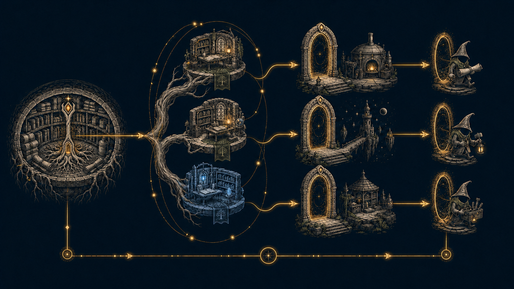

# Stave

<p align="center">
  
</p>

CLI for managing **agent workspaces** backed by shared bare Git repositories. Register upstream repos once, then spin up isolated **spaces** with editable worktrees and read-only reference checkouts—each tracked in a manifest and documented for tooling via `AGENTS.md`.

<p align="center">
  
</p>

## Why Stave

Coding agents work best in a dedicated directory with clear rules: what is editable, what is read-only context, and how branches relate to upstream. Stave automates that layout with Git worktrees instead of ad-hoc clones:

- **Bare repo cache** — one local mirror per registered remote; fetch once, reuse across spaces.
- **Spaces** — per-task workspaces under `agent-work/` with `.stave.yaml` manifest.
- **Edit worktrees** — top-level folders on branches like `stave/<space-id>/<repo>`.
- **Reference worktrees** — detached checkouts under `references/` for context only.
- **Lifecycle** — sync, status (dirty / ahead-behind), archive, destroy.
- **Memory** — optional [ContextMarmot](https://github.com/Nurozen/context-marmot) dens
  attached per space (`stave memory`); never writes in-space `.marmot/` trees.

## How Stave works

<p align="center">
  
</p>

Stave treats each registered bare repository as a shared root. A space fans that
root into isolated editable worktrees and detached reference worktrees. Portals
can carry the prepared workspace into local containers or remote hosts before a
configured coding agent is summoned into it.

## Install

**Releases** (macOS, Linux, Windows): download the archive for your platform from [GitHub Releases](https://github.com/Nurozen/stave/releases), extract `stave`, and put it on your `PATH`.

**From source** (Go 1.25+):

```bash
go install github.com/Nurozen/stave/cmd/stave@latest
```

Run `stave version` to print the installed version, commit, and build date.

To let `stave space create` and `stave review` enter the new space in your
current shell, inscribe the matching shell integration once:

```bash
stave inscribe shell --zsh  # or --bash
```

Start a new shell or source the updated startup file to activate it. Zsh uses
`${ZDOTDIR:-$HOME}/.zshrc`; Bash uses `$HOME/.bashrc`. Bash login-shell setups
must source `.bashrc`, or you can select the file explicitly with `--rc`.

If your dotfiles are managed elsewhere, use the low-level, non-mutating form
in the appropriate startup file instead:

```bash
eval "$(command stave shell-init zsh)"  # use bash when appropriate
```

The wrapper is necessary because an executable cannot change its parent
shell's directory. Other Stave commands behave exactly as before. Re-running
`stave inscribe` safely updates its marked block without duplicating it.

On Windows, space creation requires permission to create the generated
`CLAUDE.md -> AGENTS.md` symlink; enable Developer Mode or run with equivalent
administrator symlink privileges.

## Command tree

```text
stave
├── setup
├── version
├── inscribe
│   └── shell --zsh|--bash
├── shell-init bash|zsh
├── completion
├── agent
│   ├── configure
│   └── <query>
├── summon <space-id>
├── review <pr> [space-id]
├── portal
│   ├── init <space-id> [portal-id]
│   ├── attach ssh|ec2 <space-id> ...
│   ├── configure <space-id> [portal-id]
│   ├── drivers
│   ├── doctor <space-id> [portal-id]
│   ├── list [space-id]
│   ├── status <space-id> [portal-id]
│   ├── inspect <space-id> [portal-id]
│   ├── auth status|login|inherit|revoke <space-id> [portal-id]
│   ├── up|sync|shell|exec|summon|logs <space-id> [portal-id]
│   └── down|detach|destroy <space-id> [portal-id]
├── repos
│   ├── add <name> <url>
│   ├── list [--verbose] [--json]
│   ├── sync [name]
│   ├── remove <name>
│   ├── describe <repo> [text]
│   ├── tethers <repo> [--json]
│   ├── tether <from> <to> [--strong|--weak|--edit|--reference]
│   └── forget <from> [to] [--all]
├── memory
│   ├── providers [--json]
│   ├── attach <space-id> [--json]
│   ├── status <space-id> [alias] [--json]
│   ├── list [space-id] [--json]
│   ├── sync <space-id> [alias] [--json]
│   ├── propose <space-id> [alias] [--json]
│   └── detach <space-id> [alias] [--keep|--destroy] [--json]
├── config
│   ├── show [--json]
│   └── path
├── saga
│   ├── create <saga-id> [--memory ...] [--summon ...] [--no-learn]
│   ├── list [--json]
│   ├── status <saga-id> [--json]
│   ├── sync <saga-id>
│   ├── add <saga-id> <space-id> [--after <member-id>]
│   ├── remove <saga-id> <space-id>
│   ├── archive <saga-id>
│   └── destroy <saga-id> [--memory keep|destroy|contribute]
└── space
    ├── init <space-id>
    ├── create <space-id> [--memory ...] [--saga <saga-id> [--after ...]] [-c/--common] [--include-weak] [--no-learn]
    ├── add <space-id> <repo> [--no-learn]
    ├── remove <space-id> <repo> [--force]
    ├── sync <space-id>
    ├── status <space-id> [--json]
    ├── list [--archived] [--json]
    ├── archive <space-id>
    ├── restore <space-id> [--from <archive-name>]
    ├── retarget <space-id> --repo <repo> --base <ref>
    └── destroy <space-id> [--memory keep|destroy|contribute]
```

Workspace commands live under **`stave space`** (not at the top level).

## Quick start

```bash
# Create ~/stave, bare-repos/, agent-work/, and ~/.config/stave/config.yaml
stave setup

# Register remotes (clones a bare mirror locally)
stave repos add api https://github.com/you/api.git
stave repos add web https://github.com/you/web.git

# Create a space with editable + reference repos in one step
stave space create ticket-482 \
  -k ticket \
  -s ~/notes/ticket-482.md \
  -e api \
  -e web:develop \
  -r api:main \
  --summon codex

# Optional: configure the natural-language agent
stave agent configure
stave agent "create ticket-482 from ~/notes/ticket-482.md with api editable, web as a reference, and summon codex"

# Inspect the workspace
stave space status ticket-482

# Fetch remotes, refresh references, report edit drift
stave space sync ticket-482

# Stack a follow-up space on ticket-482's api branch
stave space create ticket-483 -e api:space:ticket-482
```

After the inscribed shell integration is loaded, the create command leaves the
current shell at `~/stave/agent-work/ticket-482/` after it completes.

## Reviewing a pull request

`stave review` collapses the review setup into one command: it registers the
repository if needed, fetches the PR head (`refs/pull/N/head`, so fork PRs
work too), checks it out as an editable worktree whose drift is measured
against the PR's base branch, and writes the PR's metadata (title, author,
size, checks, description) to `spec/pr-<N>.md` via the `gh` CLI when
available.

```bash
# From a URL, owner/repo#N, or a registered repo name
stave review https://github.com/owner/repo/pull/123
stave review owner/repo#123 my-review-space

# Straight into an agent session (the spec primes it with the PR context)
stave review owner/repo#123 --summon claude

# Pull in sibling repos as read-only context
stave review owner/repo#123 -r other-repo --summon claude

# Review in a registered repo the PR URL does not resolve to (SSH alias, other name)
stave review owner/repo#123 --repo my-alias

# Re-fetch PR metadata into an existing review space (e.g. after fixing gh auth)
stave review owner/repo#123 --refresh
```

Flags: `--summon`, `--prompt`, `-r/--reference` (repeatable), `--memory`
(repeatable), `--repo <name>`, `--refresh`, `--no-summon`.

**How review finds your repo.** `stave review` maps the PR onto a registered
repo in this order: a registered repo with the PR's repo name (refused if that
registration's URL parses to a different `owner/repo`; a registration whose
URL is a local path, `file://`, or otherwise unparsable is trusted by name,
since there is nothing to compare), then a registered repo whose URL is
exactly `github.com/<owner>/<repo>` under any scheme (HTTPS, SSH, `ssh://`;
the scheme's default port spelled out, `:443` or `:22`, still counts). If
nothing matches but a registered repo names the same `owner/repo` under
another host — an SSH-config alias, a GitHub Enterprise host, or `github.com`
on a non-default port such as `ssh://git@github.com:2222/owner/repo` — review
stops with an error that names that repo and tells you to re-run with
`--repo <name>`, since stave cannot know whether that host is GitHub. If more
than one registered repo matches, review errors and asks for `--repo <name>`.
If nothing matches at all it auto-registers the repo from its public
`https://github.com` clone URL; setting `origin/HEAD` and recording the
default branch are best-effort there (a failure is a note, not an error). If
the clone itself fails, the registration is unwound and the error names the
recovery (`--repo`, or `stave repos add` with an SSH URL for a private repo);
if a later step fails after the clone succeeded, the clone is kept and the
error says to retry with `stave repos add <name> <url> --adopt`.
`--repo <name>` forces a registered repo and skips every check above; PR
metadata still comes from the PR as typed. For the `<name>#N` form the owner
is derived from the registered URL only when that URL is a plain `github.com`
URL; otherwise the spec is written without metadata and the note proposes the
owner-qualified command instead — `stave review <owner>/<repo>#N --repo <name>
--refresh`, with `owner/repo` read from the registered URL for you to confirm
(or an `<owner>/<repo>` placeholder when the URL has none, e.g. a local path).

**`--refresh`** re-fetches PR metadata into an existing review space and
rewrites only `spec/pr-<N>.md` — useful when the space was created with a
minimal spec because `gh` was not authenticated. It cannot be combined with
`--reference`, `--memory`, `--summon`, `--prompt`, or passthrough agent
arguments, never auto-registers a repo, and never touches worktrees or the
manifest (it does fetch the mirror and the PR head); if metadata still cannot
be fetched, the existing spec is left unchanged. Drift is disclosed, never
repaired: on stderr and under "Refresh notes" in the spec, refresh reports
when the worktree's actual `HEAD` (a detached checkout counts) is no longer
the PR head and suggests recreating the space, when the PR's base branch
differs from the one the space was created against, and when `origin/<base>`
is missing from the mirror after the fetch (quickstart commands will fail
until it is fetched). None of these abort the refresh.

After the inscribed shell integration is loaded, `stave review` enters the
review space root after setup (and after the summoned session exits when
`--summon` is used).

Every review space ships with an embedded `pr-teach` skill (installed at
`.claude/skills/pr-teach/` inside the space), a guided review-comprehension
loop. Summoning Claude in a review space launches straight into it — no
setup and no personal skills required. Pass `--prompt` to launch with
something else instead.

Inside the space, `git diff origin/<base>...HEAD` is the full PR diff and
`stave space status` shows the PR's size as ahead/behind drift. Review
skills (for example a PR walkthrough skill) find everything they need in
`spec/` and the checked-out worktree.


## Memory (ContextMarmot dens)

Stave can attach a **provider-agnostic memory store** to a space. The first provider
is **marmot**: it creates a central den under `$MARMOT_HOME` (not inside the space)
and writes **space-local MCP** configs so agents call `marmot serve --den <id>`.

Requires a dens-aware `marmot` on `PATH` (P1b+). Optional config:

```yaml
# ~/.config/stave/config.yaml (or --config)
memory:
  provider: marmot
  binary: marmot          # or absolute path
  default: false          # if true, space create attaches memory automatically
```

```bash
export MARMOT_HOME=~/.marmot   # dens root; embedded into MCP env when set
export PATH="/path/to/marmot/bin:$PATH"

stave memory providers                 # probe marmot binary / den support
stave memory attach ticket-482         # den create --no-pointer --json
stave memory status ticket-482
stave memory list
stave memory detach ticket-482 --keep     # keep den as durable residue; strip MCP
stave memory detach ticket-482 --destroy  # destroy den + strip MCP + routes
stave memory status ticket-482 --json     # typed freshness rows for GUI hosts
```

Every `memory` verb takes `--json`; see [Machine-readable output](#machine-readable-output)
for the payload shapes and the `{"error": {code, message}}` failure envelope.

### Contracts (S2)

| Behavior | Detail |
|----------|--------|
| Attach argv | `marmot den create <id> --lifetime task --project <spacePath> --no-pointer --json` |
| Pointer | **Never** writes `.marmot-vault` into the space |
| Routes | Registers space root in `$MARMOT_HOME/routes.yml`; archive rewrites via `route set-project --from/--to` |
| MCP | Writes `.mcp.json`, `.cursor/mcp.json`, `.vscode/mcp.json`, `.codex/config.toml` with `serve --den <id>` (+ `MARMOT_HOME` when set) |
| Detach | Removes only the generated `context-marmot` MCP entries; preserves other servers |
| Destroy space | `--memory keep` (default) / `destroy` / `contribute` controls den fate |

See ContextMarmot [docs/dens.md](https://github.com/Nurozen/context-marmot/blob/main/docs/dens.md)
for dens layout, discovery order, and JSON schema fixtures.

## Layout

Default paths (overridable in config):

| Path | Purpose |
|------|---------|
| `~/stave/bare-repos/<name>.git` | Bare mirrors of registered remotes (`bareReposDir`; defaults to `<root>/bare-repos`) |
| `~/stave/agent-work/<space-id>/` | Agent workspace root (`agentWorkDir`; defaults to `<root>/agent-work`) |
| `~/.config/stave/config.yaml` | Stave configuration |

A typical space:

```text
agent-work/ticket-482/
├── .stave.yaml          # manifest (repos, modes, branches, refs)
├── AGENTS.md            # instructions for agents (generated)
├── CLAUDE.md -> AGENTS.md
├── spec/                # optional spec file or tree (if --spec was used)
├── api/                 # edit worktree; root AGENTS.md links api/AGENTS.md when present
├── web/                 # edit worktree
└── references/
    └── api/             # detached reference worktree
```

A typical saga. The saga space itself holds no edit worktrees — its members are
ordinary sibling spaces under `agent-work/`, joined by the roster in the saga's
manifest rather than by nesting:

```text
agent-work/checkout-rewrite/     # the saga space
├── .stave.yaml                  # manifest v2: member roster + after edges
├── AGENTS.md                    # coordinator instructions (generated)
├── CLAUDE.md -> AGENTS.md
├── .claude/
│   ├── settings.json            # member dirs as additionalDirectories
│   └── skills/stave-saga/       # embedded coordinator skill
├── .codex/config.toml           # member dirs as writable_roots
├── spec/                        # optional spec file or tree
└── references/                  # optional detached reference worktrees

agent-work/checkout-api/         # member space (sibling, not nested)
agent-work/checkout-web/         # member space, after: checkout-api
```

## Commands

Global flag on all commands: `--config <path>` (default `~/.config/stave/config.yaml`).

### `stave setup`

| Command | Description |
|---------|-------------|
| `stave setup [--force] [--json]` | Create root directories and write config; an existing config file is refused unless `--force`; `--json` emits `{configPath, root, bareReposDir, agentWorkDir, created[], existed[]}` |

Re-running `stave setup` over an existing `config.yaml` is refused (exit 1,
`config_exists` with `--json`) so edited settings are never discarded by
accident; pass `--force` to rewrite the file. Directories are always created
if missing.

### `stave version`

| Command | Description |
|---------|-------------|
| `stave version` | Print the Stave version, commit, and build date |

Release builds carry the values injected at link time; `go install`ed binaries
fall back to `runtime/debug` build info, and any missing field prints as
`unknown`.

### `stave inscribe`

| Command | Description |
|---------|-------------|
| `stave inscribe shell --zsh` | Add or update Stave's managed block in `${ZDOTDIR:-$HOME}/.zshrc` |
| `stave inscribe shell --bash` | Add or update Stave's managed block in `$HOME/.bashrc` |

Shell inscription accepts `--rc <path>` to target a different startup file and
`--dry-run` to inspect the target without changing it. Existing file content,
permissions, and symlinks are preserved. An exact legacy `shell-init` line is
migrated into the managed block.

### `stave shell-init`

| Command | Description |
|---------|-------------|
| `stave shell-init zsh` | Print the zsh wrapper that enables automatic space entry |
| `stave shell-init bash` | Print the bash wrapper that enables automatic space entry |

`shell-init` only prints integration code; it does not edit a startup file.

### `stave repos`

| Command | Description |
|---------|-------------|
| `stave repos add <name> <url> [--adopt] [--dry-run] [--json]` | Clone bare mirror, register it, and (best-effort) set `origin/HEAD` and record the default branch; `--adopt` reuses an existing cache at the derived path; `--json` emits `{name, url, bareRepoPath, defaultBranch?, adopted, notes[]?}` |
| `stave repos list [--verbose] [--json]` | List registered repos; `--verbose` appends each repo's description and learned tether count; `--json` emits `{name, url, bareRepoPath, defaultBranch, description, tetherCount}` rows |
| `stave repos sync [name]` | Fetch + prune bare mirror(s), then (best-effort) re-point `origin/HEAD` and backfill a missing `defaultBranch` |
| `stave repos remove <name>` | Unregister; keeps the cache unless `--purge` |
| `stave repos describe <repo> [text]` | Set the repo's description when text is given; print it otherwise (non-zero exit if unset) |
| `stave repos tethers <repo> [--json]` | List the repo's learned co-occurrence tethers, strong first, with mode, effective strength, and count |
| `stave repos tether <from> <to> [--strong\|--weak] [--edit\|--reference]` | Manually pin a tether without waiting for it to be learned; strength defaults to strong, association mode to reference |
| `stave repos forget <from> [<to>] [--all]` | Remove one `<from> → <to>` tether, or every tether from `<from>` with `--all` |

Flags: `--dry-run` and `--adopt` on `add`; `--purge` and `--dry-run` on
`remove`. `--strong`/`--weak` and `--edit`/`--reference` are each mutually
exclusive on `tether`; `forget` requires exactly one of a `<to>` argument or
`--all`. See [Learned repo tethers](#learned-repo-tethers) for the model behind
these commands.

**`add`** clones `<url>` as a bare mirror, configures branch tracking, fetches,
then — best-effort — sets `origin/HEAD` and records the remote's default
branch in config. A failure in either of those last two steps is a note on
stderr, not an error; the add still succeeds and the note says which fallback
space operations will use (re-run `stave repos sync` later to fix it).
Tracking and fetch failures are errors, and if one happens after the clone
itself succeeded the clone is kept on disk and the error says to retry with
`--adopt`. If a bare repo already sits at the derived path (for example after
`stave repos remove`, which keeps the cache), `add` refuses unless `--adopt`
is given. With `--adopt` the existing cache is reused when it is a bare repo
whose `origin` names the same repository — the same `owner/repo` for remote
URLs (host is ignored, so SSH-config aliases count) or the same local path for
path/`file://` URLs. Adoption re-points `origin` to `<url>` and runs the same
finishing steps as a fresh clone, so the cache reaches the state stave relies
on (origin URL, tracking refspec, remote-tracking refs, `origin/HEAD`, default
branch); pre-existing local branches in the cache are left as-is. If the
post-adopt fetch fails, the cache's `origin` is restored to its previous URL
and nothing is registered.

**`sync`** runs `git fetch --all --prune` on one or all mirrors, then —
best-effort — re-points `origin/HEAD` at the remote's current default branch
and, when config has no `defaultBranch` recorded for a repo, discovers and
records it. A fetch failure is an error; set-head and discovery failures are
notes, and when set-head fails discovery is skipped rather than trusting a
stale `origin/HEAD`. That backfill is the only config write, and it is skipped
when nothing changed. A recorded `defaultBranch` that disagrees with the
remote is reported as a note, never rewritten. `sync` does not touch fetch
refspecs.

**`remove`** prints `unregistered <name>` on stdout and explains the cache on
stderr: either that it was kept (with its path and, when no space uses it, a
`mv <old-path> <new-path> && stave repos add <new-name> <url> --adopt` recipe
for re-registering under a new name) or a warning that N spaces still use it.
`--purge` deletes the cache as well, but refuses when any space under the agent
work directory still references it (by name or by path; archived spaces are not
counted), when a space manifest cannot be read, or when the cache path is not a
bare git repository (delete it manually if intended). The cache is deleted
before the registry entry is dropped, so a failed delete leaves the repo
registered for a re-run. `--dry-run` previews what would happen and prints the
same kept-cache warning or re-register recipe as the real run; with `--purge`
it applies every refusal above. Recovery commands in these messages are
shell-quoted, so paths with spaces or special characters paste verbatim.

### `stave agent`

Your agentic paraclete for Stave: it reads your workspace state, proposes safe operations, and incants validated plans when allowed.

| Command | Description |
|---------|-------------|
| `stave agent configure` | Interactively choose provider/model and configure the API key |
| `stave agent <query>` | Ask the agent to plan Stave operations from natural language |

Agent query flags:

| Flag | Meaning |
|------|---------|
| `--provider` | Override configured provider (`openai` or `anthropic`) |
| `--model` | Override configured model |
| `--incant` | Execute the validated plan without prompting |
| `--no-incant` | Always print the plan only |
| `--json` | Emit machine-readable JSON |

By default, interactive terminals show the typed plan and equivalent `stave ...` commands, then prompt before execution. Non-interactive runs print the plan only unless `--incant` is set or `agent.autoIncant: true` is configured. `--no-incant` always keeps the run plan-only.

The agent uses provider-native tool calls, not a free-form JSON response. OpenAI and Anthropic both receive the same Stave tool catalog:

| Tool | Behavior |
|------|----------|
| `stave_repos_list` | Read registered repos during planning |
| `stave_repos_tethers` | Read a repo's learned co-occurrence tethers during planning |
| `stave_space_status` | Read one existing space during planning |
| `stave_repos_sync` | Queue repo cache sync for confirmation |
| `stave_space_sync` | Queue space sync for confirmation |
| `stave_space_create` | Queue new space creation for confirmation |
| `stave_space_add` | Queue adding a repo to an existing space for confirmation |
| `stave_summon` | Queue launching Codex, Claude Code, or Cursor Agent in a space |
| `stave_saga_create` | Queue creating a saga — a coordination space for sequenced multi-ticket work whose members are ordinary spaces (references become read-only context; no edit worktrees) |
| `stave_saga_status` | Read one saga during planning: members in dependency order with lifecycle state, drift, and base health (merge detection is ancestry-scoped — no PR lookup) |
| `stave_saga_add` | Queue registering a space as a saga member, optionally sequenced after other members; re-adding an existing member updates its `after` edges |
| `stave_explain_unsupported` | Record unsupported/destructive requests as notes |
| `stave_finish` | Finish planning with a summary, notes, and warnings |

Read-only tools can run immediately while the model is planning. Mutating tools never apply changes inside the model loop; they only create a validated operation plan that Stave executes after confirmation, `--incant`, or `agent.autoIncant: true`. Summoning is interactive, so `--json` and non-interactive executions include the summon command but skip the launch.

`stave_space_create` exposes the `-c/--common` behavior as two boolean args:
`common` expands each editable repo's strong tethers into references, and
`include_weak` widens that to weak tethers (and implies `common`). The planner
and CLI share the same expansion, so a planned create behaves identically to the
typed command.

Destructive operations such as archive, destroy, repo removal, reset, delete, push, PR creation, issue tracker updates, and arbitrary shell commands are intentionally not executable by the agent in v1. The same exclusion covers saga mutation beyond membership: saga archive, saga destroy, saga remove, and space retarget remain non-executable by the agent, which records such requests via `stave_explain_unsupported`.

`stave agent configure` stores API keys in macOS Keychain when available. If Keychain is unavailable, config stores an environment-variable reference such as `env:OPENAI_API_KEY` or `env:ANTHROPIC_API_KEY`. Stave does not write plaintext API keys to `config.yaml` and does not edit shell startup files.

Current built-in model defaults are `gpt-5.5` for OpenAI and `claude-opus-4-7` for Anthropic.

### `stave space`

| Command | Description |
|---------|-------------|
| `stave space init <space-id> [--json]` | Empty space (manifest + `AGENTS.md`) |
| `stave space create <space-id>` | `init` plus `--edit` / `--reference` repos |
| `stave space add <space-id> <repo>` | Add one repo (`--edit` or `--reference`) |
| `stave space remove <space-id> <repo>` | Remove one repo's worktree and manifest entry (the branch is kept) |
| `stave space sync <space-id> [--references-only] [--json]` | Fetch, update references, report edit drift; `--json` emits `{spaceId, spacePath, manifest, repos[{name, mode, action, ahead, behind, note?}], notes[]?}` |
| `stave space status <space-id> [--json]` | Manifest, dirty state, ahead/behind; `--json` emits `{spaceId, spacePath, manifest, repos[], memories[]}` with per-repo `exists/dirty/ahead/behind` |
| `stave space list [--archived] [--json]` | List spaces as `id\tkind\tpath` (`--archived` lists `.archive/` entries); `--json` emits `{id, path, kind, createdAt, isSaga, memberOf, repos[{name, mode}], archived, error, logicalId, archiveBasename, manifestCreatedAt, manifestVersion, memories[{name, provider, id, owned}]}` rows — identity is `(logicalId, manifestCreatedAt)`, see [Machine-readable output](#machine-readable-output) |
| `stave space archive <space-id>` | Remove worktrees; move space to `.archive/` |
| `stave space restore <space-id>` | Move an archived space back and re-create its worktrees |
| `stave space retarget <space-id> --repo <repo> --base <ref> [--dry-run] [--json]` | Repoint an edit repo's recorded base without touching the worktree (rewrites the manifest only) |
| `stave space destroy <space-id>` | Remove worktrees and delete space directory |

Space commands take a plain space ID. Relative-path spellings such as
`.archive/<id>` (previously accepted by some read and lifecycle verbs) are no
longer valid space IDs and are rejected.

`stave space restore` is the inverse of `archive`: it moves the archived
directory back and re-creates every worktree from the manifest, edit repos at
their recorded branch (which archive left in the bare repo) and references
detached at their recorded ref. It picks `.archive/<id>` when present,
otherwise the single `.archive/<id>-<timestamp>` copy; with several
timestamped copies it refuses and lists them, and `--from <name>` chooses one.
A missing edit branch refuses before anything moves; a missing reference ref
skips that worktree with a warning. A live space with the same id, or a
different space's archive named via `--from`, is refused. `stave space remove`
is the inverse of `add`: the worktree is removed and pruned, the manifest and
`AGENTS.md` rewritten, and the edit branch is never deleted (Stave never
deletes branches).

Space flags:

| Flag | Commands | Meaning |
|------|----------|---------|
| `--kind`, `-k` | `init`, `create` | Free-form label for the space (e.g. `ticket`, `spike`, `audit`), with two reserved behavioral kinds: `review`, which `stave review` sets and which launches Claude into the `pr-teach` skill, and `saga`, which is rejected here — use `stave saga create` |
| `--spec`, `-s` | `init`, `create` | Copy a spec file or directory into `spec/` |
| `--edit`, `-e` | `create` | Editable worktree from base ref (`repo` or `repo:base`; `base` may be `space:<id>` sugar; repeatable) |
| `--reference`, `-r` | `create` | Detached reference worktree (`repo` or `repo:ref`; repeatable) |
| `--saga` | `create` | Register the new space as a member of this saga |
| `--after` | `create` | Member id the new space lands behind (requires `--saga`; repeatable) |
| `--summon` | `create` | Launch `codex`, `claude`, or `cursor` after the space is created |
| `--common`, `-c` | `create` | Also add reference worktrees for the edited repos' **strong** learned tethers (see [Learned repo tethers](#learned-repo-tethers)) |
| `--include-weak` | `create` | With `--common`, widen the expansion to weak tethers too (implies `-c`) |
| `--no-learn` | `create`, `add` | Do not record co-occurrence tethers for this invocation |
| `--edit`, `-e` / `--reference`, `-r` | `add`, `remove` | Mode: exactly one required for `add`; for `remove` one is required only when the repo is present in both modes |
| `--base`, `-b` | `add` | Base branch/ref for edits (`space:<id>` sugar accepted), or ref for references |
| `--branch` | `add` | Branch name for editable repos |
| `--no-fetch` | `add` | Skip fetching the bare repo before adding |
| `--references-only` | `sync` | Only sync reference worktrees |
| `--force` | `remove`, `archive`, `destroy` | Proceed despite dirty edit worktrees (and, for `remove`/`archive`/`destroy`, other spaces stacked on the affected branches) |
| `--from` | `restore` | `.archive/` entry name to restore when several `<id>-<timestamp>` copies exist |
| `--dry-run` | `create`, `add`, `remove`, `archive`, `restore`, `destroy` | Print Git operations without changing state |

#### Base and ref resolution

A base (`-e repo:<base>`, `--base`) or reference ref (`-r repo:<ref>`) is
resolved against the remotes the repo's bare mirror actually has, then checked
for existence before any worktree is created:

| Spelling | Resolves to | Recorded as |
|----------|-------------|-------------|
| `main` | `refs/remotes/origin/main` | `origin/main` |
| `origin/main` | `refs/remotes/origin/main` | `origin/main` |
| `fork/main`, when the mirror has a `fork` remote | `refs/remotes/fork/main` | `refs/remotes/fork/main` |
| `fork/main`, when it does not | `refs/remotes/origin/fork/main` | `origin/fork/main` |
| `refs/...` | itself | itself |

So a mirror with a second remote (`stave repos add` clones one `origin`; a
fork remote is added with `git remote add` in the bare repo) can be based on
that remote directly — `-e t3code:fork/main` — instead of the long
`refs/remotes/fork/main` spelling. A first path segment that names no remote
is still treated as a branch on `origin`, which keeps `feature/login` working.

A ref that resolves to nothing is refused by Stave, not by `git worktree add`:
the message names the full ref it looked for and the remotes the mirror has,
and `--json` returns `{"error":{"code":"ref_not_found","details":{"repo","ref","tried","remotes"}}}`.
`--dry-run` performs the same resolution and the same check, so the printed
plan names the ref the real run would use. The check reads the mirror as it
stands; run `stave repos sync <repo>` first if the branch was pushed since the
last fetch.

When `--spec` points at a file, it is copied under `spec/` with its original basename. When it points at a directory, the directory contents are copied into `spec/`. The manifest records `specPath: spec`.

When `--summon` is present, unrecognized trailing flags are passed verbatim to
the selected agent before its launch prompt. For example,
`stave space create ticket-482 --summon codex --yolo` launches Codex in yolo
mode. Stave's own flags remain Stave-owned; use `--` before a colliding agent
flag, such as `--summon codex -- --config agent.toml`.

### Stacking spaces

A follow-up space can base its edit branch on another space's edit branch
instead of a remote branch. The base sugar `space:<id>` resolves to the edit
branch that space owns for the same repo:

```bash
# First ticket branches from the remote default
stave space create pay-1 -e api

# Second ticket stacks on pay-1's api branch
stave space create pay-2 -e api:space:pay-1
```

`pay-2`'s drift then reports against `pay-1`'s branch and live-tracks it: as
`pay-1` gains commits, `stave space sync pay-2` shows how far `pay-2` is ahead
of or behind its sibling.

Two warnings to watch for:

- **Canonicalization.** Hand-typed `stave/...` or `origin/stave/...` bases are
  rewritten to `refs/heads/stave/...` with a notice. Stave branches live only
  in the bare repo — Stave never pushes them — so the `origin/...` spelling
  would never resolve.
- **Stale-branch adoption.** If the edit branch already exists, the new
  worktree adopts its current head; the requested base/start-point is ignored
  and the recorded base is aspirational. Stave warns and reports how far the
  adopted branch is ahead of or behind the requested base.

When the base space's work merges, repoint the stacked space at the merged
branch:

```bash
stave space retarget pay-2 --repo api --base origin/main
```

`retarget` rewrites only the recorded base in the manifest — the ref drift is
measured against — without touching the worktree. `--repo` is required, the
same base sugar and canonicalization apply, and a resolved `stave/...` base
must exist in the bare repo. Archiving or destroying a space that a sibling
still stacks on fails closed unless `--force` is given.

### Learned repo tethers

Stave already sees every `-e`/`-r` you pass, so it quietly remembers which repos
you use together. Every non-dry-run `stave space create` and `stave space add`
(and their agent-planner equivalents, and `stave review` pairings) records a
directed **tether** from each editable repo to every other repo in the space,
counting how often the pairing recurs and whether the other repo showed up as an
edit or a reference. A tether crosses from **weak** to **strong** once its count
reaches `tethers.strongThreshold` (default 3); you can also pin either strength
by hand with `stave repos tether`.

That learning pays off with `-c/--common` on `stave space create`: instead of
re-typing the usual reference set, `-c` auto-pulls every strong tether of the
repos you are editing as reference worktrees (`--include-weak` widens that to
weak ones too), de-duplicated against your explicit `-e`/`-r` and skipping any
repo that is no longer registered. `-c` only ever adds references — it never
materializes extra editable worktrees — and the repos it pulls in do not
themselves reinforce the counts, so the numbers stay a record of what you
actually typed. Inspect what has been learned with `stave repos tethers <repo>`
or `stave repos list --verbose`, and prune with `stave repos forget`. Learning
is passive but easy to opt out of: pass `--no-learn` for a single create/add, or
set `tethers.enabled: false` to turn capture off machine-wide.

### `stave saga`

A **saga** is a coordinating space for work that spans several dependent
spaces: one epic split across three tickets, or a migration whose web change
cannot land before its API change. The saga space holds the spec, the roster of
member spaces, and the ordering between them — but no edit worktrees of its
own. The members are ordinary spaces that each own their branches; the saga
records how they relate. The durable reference for the frozen `saga status
--json` schema, base-health semantics, and merge awareness is
[docs/saga.md](docs/saga.md).

| Command | Description |
|---------|-------------|
| `stave saga create <saga-id>` | Create a saga space with an empty member roster |
| `stave saga list` | List every space with its kind and saga membership |
| `stave saga status <saga-id>` | Members in dependency order with state, drift, and topology notes |
| `stave saga sync <saga-id> [--dry-run] [--json]` | Fetch each shared bare repo once, then sync every live member |
| `stave saga add <saga-id> <space-id>` | Register an existing space as a member |
| `stave saga remove <saga-id> <space-id>` | Drop a member from the roster |
| `stave saga archive <saga-id>` | Archive every member in reverse topological order, then the saga space |
| `stave saga destroy <saga-id>` | Destroy every member in reverse topological order, then the saga space |

Saga flags:

| Flag | Commands | Meaning |
|------|----------|---------|
| `--spec`, `-s` | `create` | Copy a spec file or directory into the saga's `spec/` |
| `--reference`, `-r` | `create` | Detached reference worktree (`repo` or `repo:ref`; repeatable) |
| `--memory` | `create` | Attach memory: `[provider:]<spec>`; `.` creates a fresh store (repeatable, at most one fresh) |
| `--summon` | `create` | Launch `codex`, `claude`, or `cursor` after the saga is created |
| `--no-learn` | `create` | Suppress tether learning for this invocation only — kept for surface symmetry with space `create`. The saga root is a reference-only space with no editable anchor, so the flag is effectively a no-op for the root and is not persisted to members; each member still learns unless it passes `--no-learn` on its own create |
| `--after` | `add` | Member id this space lands behind (repeatable) |
| `--clear-after` | `add` | Reset the member's `after` edges before applying `--after` |
| `--json` | `list`, `status`, `create`, `add`, `remove`, `archive`, `destroy` | Emit machine-readable JSON (for `status`, the frozen `SagaStatus` contract; for `list`, rows with `path` and `logicalId`) |
| `--force` | `archive`, `destroy` | Proceed despite dirty member worktrees, external spaces stacked on member branches, or (destroy) other spaces sharing the saga den |
| `--memory` | `archive`, `destroy` | Saga den fate: `keep` (default) or `contribute` on archive; `keep`, `destroy`, or `contribute` on destroy |
| `--dry-run` | `create`, `sync`, `add`, `remove`, `archive`, `destroy` | Print operations (for `archive`/`destroy`, the ordered teardown plan) without changing state |

A saga takes shape in one of two directions — create the saga first and hang
members off it, or register spaces you already have:

```bash
# Create the saga, then create members directly into it
stave saga create checkout-rewrite -s ~/notes/checkout-epic.md
stave space create checkout-api -e api --saga checkout-rewrite
stave space create checkout-web -e web --saga checkout-rewrite --after checkout-api

# Or adopt an existing space into an existing saga
stave saga add checkout-rewrite billing-cleanup --after checkout-api

# Where everything stands, in dependency order
stave saga status checkout-rewrite

# Fetch each bare repo once, sync every live member
stave saga sync checkout-rewrite
```

`--after` records that `checkout-web` lands behind `checkout-api`, which orders
the roster in `saga status` and lets it flag stacking that crosses the
dependency graph. Ordering must stay acyclic and every `--after` target must
already be a member — both are checked when the manifest is saved. `saga add`
upserts: re-adding a member with no `--after` leaves its existing edges alone,
a non-empty `--after` replaces them, and `--clear-after` resets them first.

On `space create --saga … --after …`, an `--after` edge also picks the base for
any `--edit` repo you did not give an explicit base to — the two members above
edit different repos, so nothing is inferred there, but when a member follows a
predecessor *into the same repo* its branch stacks on that predecessor's branch
instead of the remote default:

```bash
stave space create api-part-2 -e api --saga checkout-rewrite --after checkout-api
# api-part-2's api branch starts from stave/checkout-api/api, not origin/main
```

Its drift is then reported against its predecessor. The rule is deliberately
conservative: exactly one predecessor editing the repo means stack on it, no
predecessor editing it falls back to the usual default-base chain, and several
predecessors editing it makes Stave refuse rather than guess — it asks for an
explicit base (`-e <repo>:space:<id>`, the same sugar described under
[Stacking spaces](#stacking-spaces)). The inference happens only at creation:
`saga add` records edges on a space whose branches already exist and never
repoints them — use `stave space retarget` for that.

Two rejections keep the roles apart. `stave saga create` refuses `-e`/`--edit`,
because a saga holds no edit worktrees — create a member instead. And
`stave space init`/`create` refuse `-k saga`, because the kind is reserved for
`stave saga create` (which sets it, and the member roster that goes with it).
Anything after a literal `--` still forwards to the summoned agent as usual.

`saga create` also rejects `-c`/`--common` and `--include-weak`: tether
expansion is anchored on an editable repo, and a saga has none. Members created
through `stave space create --saga … -e <repo> -c` still expand normally, since
that path does carry an editable anchor.

`saga status` lists members in dependency order, each with its lifecycle state
(`live`, `archived`, `missing`, or `corrupt`), its `after` predecessors, and —
for live members — per-repo dirtiness, the recorded base, whether that base
still exists, and ahead/behind drift. Notes call out topology problems worth
knowing about, such as a member stacked on a branch owned by a space outside
the saga, or on a member that is not one of its declared predecessors.

`saga status` also takes `--json`, emitting the frozen `SagaStatus` contract
(including merge detection); `saga sync` is human-readable output only.
`saga list` already has
`--json`, and it covers every space — not just saga members — so it doubles as
the "what is joined to what" view.

Because members are sibling directories rather than subdirectories of the
saga, an agent summoned in the saga root would not normally be allowed to touch
them. Stave keeps the harness settings at the saga root in step with the roster
on every membership change: `.claude/settings.json` gains the member paths
under `permissions.additionalDirectories`, and `.codex/config.toml` gains them
under `sandbox_workspace_write.writable_roots`. Both edits are merge-aware —
only Stave's own entry is rewritten, and the rest of an existing file survives.

Every saga space ships with an embedded `stave-saga` skill (installed at
`.claude/skills/stave-saga/` inside the space), a coordinator loop for driving
members in order. Summoning Claude in a saga space launches straight into it —
no setup and no personal skills required. Other summoners, and saga spaces
that never received the skill, get a coordinator stance prompt instead. Pass
`--prompt` to launch with something else.

Memory attached to a saga is shared with its members: a member that has no
memory of its own is given MCP configuration pointing at the saga's den, so
every agent in the saga reads and writes one context store. See
[`docs/memory.md`](docs/memory.md) for the full recipe.

Single-space lifecycle stays out of saga state: `stave space archive` and
`stave space destroy` refuse to act on a saga space (use `stave saga archive`
or `stave saga destroy` to tear it down with its members) or on a registered
member (use `stave saga remove` to drop it from the roster first). Pass
`--force` to override the refusal and archive or destroy the space anyway —
the roster is then left as-is and may reference a space that no longer
exists. `stave space restore` is non-destructive and always proceeds; it
prints a note that saga status may be stale until `stave saga sync`.

### `stave summon`

| Command | Description |
|---------|-------------|
| `stave summon <space-id> --with codex` | Start Codex in the space root |
| `stave summon <space-id> --with claude` | Start Claude Code in the space root |
| `stave review <pr>` | One-step PR review space: fetch the PR head, check it out, record metadata under `spec/` |
| `stave review <pr> --summon claude` | Same, then launch Claude Code in the review space |
| `stave review <pr> -r <repo> --summon claude --prompt "/skill"` | Add read-only reference repos and launch straight into a review skill |
| `stave review <pr> --repo <name>` | Review in a specific registered repo when the PR URL does not resolve to it (SSH alias, other name) |
| `stave review <pr> --refresh` | Re-fetch PR metadata into an existing review space; rewrites `spec/pr-<N>.md` only |
| `stave summon <space-id> --with cursor` | Start Cursor Agent in the space root |

Summoned agents always launch from `agent-work/<space-id>`, not from an individual repo. That gives them the manifest, generated `AGENTS.md`, copied specs, editable top-level repos, and `references/` context in one working directory.

`--print-command` prints the launch command instead of running it. Non-interactive terminals also print instead of launching. `cursor` maps to the Cursor Agent CLI (`cursor-agent`), not the Cursor GUI editor.

Agent flags can also follow the direct command, for example
`stave summon ticket-482 --with codex --yolo`.

### `stave portal`

Attach execution environments to an existing Stave space without changing the
space as the source of truth.

| Command | Description |
|---------|-------------|
| `stave portal init container <space-id>` | Record a Stave-owned Docker portal |
| `stave portal init devcontainer <space-id>` | Record a devcontainer portal |
| `stave portal attach ssh <space-id> <host>` | Attach an existing SSH host |
| `stave portal attach ec2 <space-id> <instance-id> --region <region>` | Attach an existing EC2 instance |
| `stave portal status <space-id> --json` | Emit stable portal status JSON |
| `stave portal summon <space-id> --with codex --mode print` | Print the in-portal agent launch command |
| `stave portal summon <space-id> --with codex --mode tmux` | Launch the agent inside a detached tmux session on the portal target |

`stave portal summon` takes `--mode foreground` (default), `tmux`, `headless`,
or `print`. In `tmux` mode Stave starts the summoner inside a detached,
idempotently-created tmux session named `stave-<space>-<portal>` on the target,
then attaches only when a real terminal is present (headless and non-interactive
runs stay detached and print how to attach). `tmux` mode requires `tmux` on the
target; `stave portal logs` can read the session's pane back only for ssh/ec2
portals (docker/devcontainer logs read container stdout, not the tmux pane).

Local login credentials are never copied silently. Use `stave portal auth
login` to authenticate inside the portal target, or explicit `auth inherit`
methods when you really want inherited auth behavior.

See [`docs/portal.md`](docs/portal.md) for a practical portal quickstart and
command guide.

## Configuration

Example `~/.config/stave/config.yaml`:

```yaml
root: ~/stave
bareReposDir: ~/stave/bare-repos
agentWorkDir: ~/stave/agent-work
defaultBase: main
repos:
  api:
    name: api
    url: https://github.com/you/api.git
    bareRepoPath: ~/stave/bare-repos/api.git
    defaultBranch: main
    description: Core HTTP API service   # optional; set via `stave repos describe`
tethers:
  enabled: true          # global kill switch for passive tether learning
  strongThreshold: 3     # co-occurrence count at which a tether becomes "strong"
agent:
  defaultProvider: openai
  autoIncant: false
  providers:
    openai:
      model: gpt-5.5
      apiKeyRef: keychain:stave/agent/openai
    anthropic:
      model: claude-opus-4-7
      apiKeyRef: env:ANTHROPIC_API_KEY
summon:
  default: codex
  commands:
    codex: codex
    claude: claude
    cursor: cursor-agent
```

- **`defaultBase`** — fallback ref when a repo or `--edit` / `--reference` spec omits a branch.
- **`defaultBranch`** (per repo) — detected on `repos add` and backfilled by `repos sync` when missing; overrides `defaultBase` for that repo.
- **`agent.defaultProvider`** — provider used by `stave agent` unless `--provider` is set.
- **`agent.autoIncant`** — when true, `stave agent` executes validated plans without prompting or requiring `--incant`; `--no-incant` still wins.
- **`agent.providers.*.apiKeyRef`** — secret reference; either `keychain:stave/agent/<provider>` or `env:<NAME>`.
- **`summon.default`** — summoner used when `stave summon` omits `--with`.
- **`summon.commands.*`** — command names or paths for `codex`, `claude`, and `cursor`.
- **`repos.<name>.description`** — optional free-text label shown by `stave repos list --verbose` and `stave repos describe`; set it via `stave repos describe <repo> "text"`.
- **`tethers.enabled`** — global kill switch for passive tether learning (default `true`). When `false`, captures are skipped and `-c/--common` errors with a hint to re-enable.
- **`tethers.strongThreshold`** — co-occurrence count at which a learned tether is classified **strong** (default `3`; values below `1` are clamped back to `3`).

Editable branches default to `stave/<space-id>/<repo>` unless `--branch` is set.

Learned tethers themselves are **not** stored in `config.yaml`. They live in a
machine-local sidecar at `~/stave/repo-tethers.yaml` (under `config.Root`), with
a companion `~/stave/repo-tethers.yaml.lock`. The file is purely machine-generated
co-occurrence data — safe to delete and regenerate, never committed to a repo,
and ignored entirely by older Stave binaries. Human input (repo descriptions)
lives on the registry instead, so wiping the sidecar loses no hand-authored data.

## Machine-readable output

Read commands take `--json` for GUI hosts and scripts; output is indented JSON
with secret-looking values redacted. Manifest fields keep their `.stave.yaml`
key names (`id`, `kind`, `createdAt`, `repos[].bareRepoPath`, `saga.members[]`).

| Command | Emits |
|---------|-------|
| `stave space status <space-id> --json` | `{spaceId, spacePath, manifest, repos[], memories[]}` |
| `stave space list [--archived] --json` | Space rows with kind, saga join, repo and memory summary, and host identity (below) |
| `stave saga list --json` / `stave saga status <saga-id> --json` | Saga rows (`{id, kind, isSaga, members[], memberOf, error, path, logicalId}`) / the frozen `SagaStatus` contract |
| `stave repos list --json` / `stave repos tethers <repo> --json` | Registry rows / learned tethers |
| `stave portal list|status|inspect|drivers|doctor|auth status ... --json` | Portal state |
| `stave agent <query> --json` | Plan, questions, and results |
| `stave memory list [space-id] --json` | `[{spaceId, spacePath, attachments: [{name, provider, id, owned}]}]` — every live space with attachments, or the one space (empty `attachments` allowed) |
| `stave memory status <space-id> [alias] --json` | `{spaceId, attachments: [{name, provider, id, owned, state?, lifetime?, links: [{alias, kind, ahead?, behind?, pending?, stale?, reachable?, state?}], error?}]}` — the fields the human rows parse from `den status --json` |
| `stave memory providers --json` | `[{name, binary?, default, available, version?, capabilities: ["dens", "refs", "links", "warrens", ...], error?}]` — capabilities as probed from the binary |
| `stave config show --json` | `{configPath, exists, root, bareReposDir, agentWorkDir, defaultBase, repos: {name: {name, url, bareRepoPath, defaultBranch?, description?}}, memory: {provider, binary, default}, tethers: {enabled, strongThreshold}, summon: {default, commands}}` — the resolved config exactly as every verb loads it (defaults overlaid, `~` expanded); the `agent` section is omitted; `exists: false` when the file is absent |

### Space identity for hosts

A `space list --json` row's `id` is the **directory name**: for live rows the
space id, for `--archived` rows the `.archive/` basename, which is
`<id>-<timestamp>` when an archive had to disambiguate a collision. The
identity a host should reconcile on is the pair **`logicalId` +
`manifestCreatedAt`**:

| Field | Meaning |
|-------|---------|
| `logicalId` | the manifest's `id`; `null` on error rows (the manifest could not be read) |
| `manifestCreatedAt` | the manifest's `createdAt` in RFC3339Nano (UTC) — full fractional precision, so it compares equal to the stamp in `.stave.yaml` and to `saga.members[].createdAt`; omitted when the manifest carries no stamp. The legacy `createdAt` is truncated to whole seconds and kept for compatibility |
| `archiveBasename` | archived rows only: the `.archive/` directory name (equals `id`) |
| `manifestVersion` | the `.stave.yaml` schema version (`0` = pre-version or unreadable) |
| `memories[]` | the manifest's attachments, `{name, provider, id, owned}` |

`saga list --json` rows carry the same `path` and `logicalId` (`null` on error
rows). Every v0.3 field keeps its name, type, and meaning.

Mutating space and saga verbs take `--json` too, so a GUI host never parses
prose. Human output is unchanged when the flag is absent. `--summon` is
interactive and is refused alongside `--json`.

| Command | Emits on success |
|---------|------------------|
| `stave space init|create|add|remove|restore|retarget ... --json` | `{spaceId, spacePath, manifest, notes[]?}` — the manifest is reloaded from disk after the operation; `notes` carries the notices a human run prints (canonicalization, stale-branch adoption, memory link kept, saga sync hint) |
| `stave space sync <space-id> [--references-only] --json` | `{spaceId, spacePath, manifest, repos: [{name, mode, action, ahead, behind, note?}], notes[]?}` — one row per processed repo (`--references-only` drops edit rows, as the human output does); `action` is `updated` (reference checked out), `skipped` (dirty reference left alone; `note` says why), `drift-reported` (edit repo; `ahead`/`behind` versus its base) or `fetched` (edit repo whose drift probe failed; `note` carries the error) |
| `stave space archive <space-id> --json` | `{spaceId, archivedPath, memory: "keep"\|"contribute", notes[]?}` |
| `stave space destroy <space-id> --json` | `{spaceId, spacePath, destroyed: true, memory: "keep"\|"destroy"\|"contribute", notes[]?}` |
| `stave saga create|add|remove ... --json` | `{sagaId, spacePath, manifest, notes[]?}` |
| `stave saga archive|destroy <saga-id> --json` | `{sagaId, action: "archived"\|"destroyed", memory, sagaPath, sagaArchivedPath?, members: [{id, action: "archived"\|"destroyed"\|"skipped", note?, path, archivedPath?}], notes[]?}` — members in teardown order; `path` is the member's live root before teardown, `archivedPath` its `.archive/` destination (archive) or, for a skipped already-archived member, the existing archive; `sagaArchivedPath` is the saga space's own destination (archive only) |
| `stave saga sync <saga-id> --json` | `{sagaId, spacePath, members: [{id, state: "live"\|"archived"\|"missing", repos: [space-sync rows], note?}], repos[]?, notes[]?}` — members in walk order; skipped members carry the reason in `note` and an empty `repos`; top-level `repos` are the saga space's own reference rows; `notes` carries the merge findings and degrade notices the human walk prints |
| `stave repos add <name> <url> [--adopt] --json` | `{name, url, bareRepoPath, defaultBranch?, adopted, notes[]?}` — `adopted` is true when an existing cache was reused; `notes` carries the `note:` lines a human run prints to stderr (adoption, origin/HEAD, default-branch discovery) |
| `stave setup [--force] --json` | `{configPath, root, bareReposDir, agentWorkDir, created: [paths], existed: [paths]}` — every root directory and the config file sorted by whether this run created it |
| `stave memory attach <space-id> ... --json` | `{spaceId, spacePath, manifest, attachments: [{name, provider, id, owned, linked?: [{reference, target?, kind, resolvedVia?}]}], notes[]?}` — `linked` lists the reference links the provider resolved on create |
| `stave memory detach <space-id> [alias] --json` | `{spaceId, spacePath, manifest, detached: [{name, provider, id, fate: "keep"\|"destroy"}], notes[]?}` — `fate` is the one that applied (an unowned store is always kept) |
| `stave memory sync <space-id> [alias] --json` | `{spaceId, results: [{alias, warren?, outcome: "synced"\|"up-to-date"\|"failed", detail?}], notes[]?}` — one row per cached warren |
| `stave memory propose <space-id> [alias] --json` | `{spaceId, results: [{alias, outcome: "proposed"\|"up-to-date", detail?, branch?, commit?, pushCommand?, contributed?}], notes[]?}` — stave never pushes; `pushCommand` is the operator's handoff |
| any of the above with `--dry-run --json` | `{dryRun: true, plan: [each line the human dry-run prints]}` |

On failure with `--json` the command prints one envelope to **stdout** and
exits 1 (nothing is written to stderr):

```json
{ "error": { "code": "dirty_worktrees", "message": "space \"t-1\" has dirty editable worktrees: api", "details": { "repos": ["api"] } } }
```

| Code | Meaning | `details` |
|------|---------|-----------|
| `dirty_worktrees` | an editable worktree has uncommitted changes (`--force` overrides) | `repos[]` |
| `dependent_spaces` | another live space stacks on a branch this operation would retire | `spaces[]`, `repo`, `branch` |
| `memory_in_use` | the memory den is held by a live agent session (`--force` does not help; also raised by `memory detach`) | |
| `space_exists` | a live space already occupies the id/path (restore, saga create, create across the saga boundary) | `path` |
| `space_not_found` | no live space under that id | |
| `repo_not_found` | the repo is not registered (`stave repos add`) | `repo` |
| `repo_not_in_space` | the space's manifest lists no such repo | `repo` |
| `repo_already_in_space` | `space add` refuses a second entry for a repo in the same mode (edit + reference of one repo stays allowed) | `repo`, `mode` |
| `repo_mode_ambiguous` | `space remove` needs `--edit` or `--reference` because the repo is present in both modes | `repo`, `modes` |
| `saga_space` | a single-space verb was aimed at a saga space; use `stave saga archive|destroy` | |
| `saga_member` | a single-space verb was aimed at a saga member; `stave saga remove` it first (or a space is already a member of another saga) | `saga` |
| `invalid_name` | a space id or repo name fails the safe-name pattern | `label`, `name` |
| `branch_missing` | restore: an edit repo's recorded branch no longer exists in the bare repo | `repo`, `branch` |
| `ref_not_found` | `space create`/`add`: the base or reference ref resolves to nothing in the repo's bare mirror | `repo`, `ref`, `tried`, `remotes[]` |
| `repo_path_taken` | `space add`: another manifest entry already occupies the directory the repo would take | `space`, `repo`, `path` |
| `ambiguous_archive` | restore: several `<space-id>-<timestamp>` archives match; pass `--from` | `candidates[]` |
| `archive_not_found` | restore: no `.archive/` entry for the id | |
| `repo_exists` | `repos add`: the name is already registered | `repo` |
| `cache_exists` | `repos add`: a bare repo already sits at the derived cache path; pass `--adopt` to reuse it | `repo`, `path` |
| `clone_failed` | `repos add`: the fresh bare clone failed; `message` carries the git error | `repo` |
| `config_exists` | `setup`: the config file exists and `--force` was not given | `path` |
| `invalid_arguments` | flag/usage refusal (`--edit` with `--reference`, `--memory destroy` on archive, `--summon` with `--json`, `--repo`/`--base` missing on retarget, ...) | |
| `unknown` | any other failure; `message` is the human error text | |

When `saga archive|destroy` fails **mid-walk** (a member's or the saga space's
own teardown step errors after earlier members were already torn down), the
envelope keeps the cause's `code` and `details` and adds what got done, so a
host can reconcile without rescanning the work directory:

```json
{ "error": { "code": "unknown", "message": "saga archive: member jf-1: ...",
  "details": {
    "completed": [{ "id": "jf-2", "action": "archived", "path": "/…/agent-work/jf-2", "archivedPath": "/…/agent-work/.archive/jf-2" }],
    "failedAt": "member",
    "failedMember": "jf-1" } } }
```

`completed` lists the steps that finished this run in walk order (always
present, `[]` when nothing was torn down; `archivedPath` only for archive);
`failedAt` is `member`, `saga` (the saga space's own step; `failedMember` is
then the saga id) or `den` (a den-first destroy refused before any member
teardown; no `failedMember`). Guard refusals raised before the walk starts
(`dirty_worktrees`, `dependent_spaces`, ...) carry their usual details only —
nothing was torn down. Re-running the same command converges (see
[docs/saga.md](docs/saga.md#saga-aware-lifecycle-saga-archive-and-saga-destroy)).

Argument-count and flag-spelling mistakes are still reported by the CLI
parser (usage text, exit 1) before the verb runs.

## Development

```bash
go test -race ./...
go build -o stave ./cmd/stave
```

Lint: `golangci-lint run` (see `.golangci.yml`).

Releases are built with [GoReleaser](https://goreleaser.com/) (`.goreleaser.yml`); signed macOS binaries when release secrets are configured.

## Default branch

This repository uses **`weirwood`** as its default branch (the staff base), not `main`.

## License

Released under the [MIT License](LICENSE). Copyright (c) 2026 Cloud Gatherer Labs LLC.
